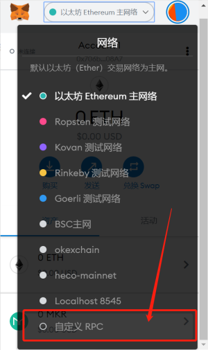
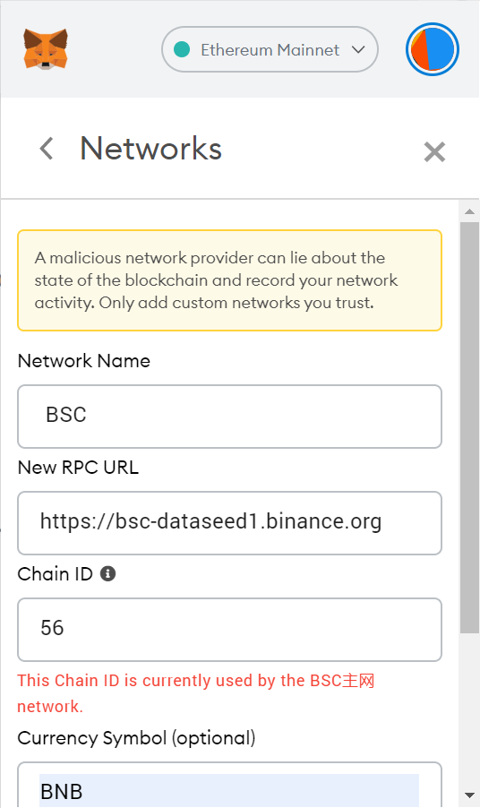
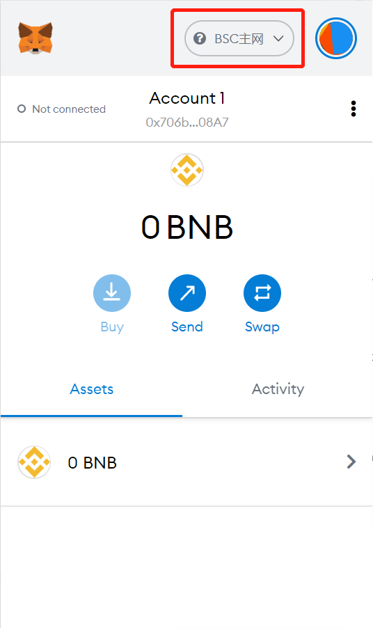

# BSC Tutorial

## MetaMask Wallet Configuration BSC Tutorial

#### Personal Computer

1. Click on the Website to select


2. Custom RPC



3. Adding Website Information


 
**The information is as follows:**
```
- Network name: BSC
- Add RPC URL: https://bsc-dataseed1.binance.org/
- Chain ID: 56
- Symbol：BBNB
- Blocking Manager URL: https://bscscan.com/
```
 
4. Check the main website of the creation chain

