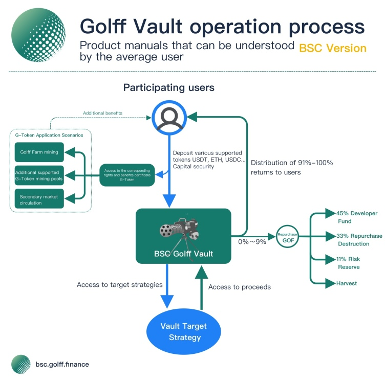

# BSC Golff Vault Tutorial

## What is BSC Golff Vault

BSC Golff Vault is an intelligent earnings aggregator (Earn Collection) based on the Cryptocurrency Smart Chain, which is based on the DeFi protocol that automatically achieves the best earnings strategy configuration. It can provide investors with one-click access to the best returns on the BSC chain, thus greatly reducing the entry barrier for ordinary investors while reducing the loss of returns due to information asymmetry.

## What are the advantages of BSC Golff Vault
1. Eliminate the complex contract operation link of liquidity mining, BSC version of Golff Vault can help users save more contract operation fees, users only need to top up assets to Gollf Vault BSC version of smart contracts as an agent and top up/withdraw with one click to get the best returns in the market. 

2. The front-end is developed by the core team of more than 10 full-time contract engineers, and each contract is audited by a globally renowned security company for code audit to ensure the security of the contract to the maximum extent. Meanwhile, Golff's team of community engineers is gradually being formed, and we welcome all outstanding developers to join Golff's contract development and auditing. In the future, Golff's insurance products will also support contracting with strategies in BSC Golff Vault to further reduce possible risk losses.

3. Market information collection by more than 20 strategy analysts in the community to be the first to discover high-yielding strategies and submit them to the contract group for development. Compared to the original Golff Vault V2, the BSC version of the Vault will support a much richer set of strategies and be the fastest to find the latest and highest quality strategies for users. 

4. BSC Golff Vault is a smart contract governed by Golff DAO, with funds decentralized and hosted by the contract, without the need to trust third parties. 

5. Automatic rebalancing of revenue strategies: Based on current market conditions, the BSC Golff Vault partial Vault pool will automatically switch strategies. For a certain coin, users do not need to withdraw coins and recharge to a new pool to get the highest return in the current market. 

6. The latest version of BSC Golff Vault will support automatic reinvestment function, helping users to maximize the benefits of their funds without additional operations.

## How to use Golff Vault
1. Open the official website to prepare the wallet and sufficient tokens, need to prepare some BNB for contract fees. (You need to switch your Metamask/mobile wallet to BSC network) 

2. Select the coins to be involved in pledging

3. Authorize the wallet before depositing. Then enter the quantity and click "Deposit" to start Gollf Vault mining and get the best return in the current market.

4. After successful deposit, you will receive the corresponding number of G-Tokens in your on-chain wallet, you can check the G-Token balance on BSC browser or add the corresponding coin contract address in your wallet. Each G-Token represents your share of the Vault pool. You can also deposit G-Tokens into the pool to get additional GOF mining revenue. 

5. Enter the amount and click "Withdraw" to receive the number of G-Tokens that can be exchanged in the Vault pool. If the funds are in the pool, you need to take the G-Tokens out of the pool first, and the page will show the number of G-Tokens in mining. (Some of the Vault pool strategy deposit and withdrawal are subject to handling fee, the actual amount is based on the amount on the chain, Golff platform does not charge extra handling fee when accessing the operation, please refer to the page prompt for the specific fee) 

## Earning Distribution
The proceeds of various cryptocurrencies generated in the BSC Golff Vault pool are automatically put into the Vault pool, of which 91% to 100% of the proceeds are allocated to the fund contributors and the remaining 0% to 9% is used to repurchase GOF in the secondary market, of which 45% of the repurchase portion is for the community developer fund, 33% is destroyed, 11% is for the risk reserve, and 11% is for harvest Contract call fees. The risk reserve is used to cover losses incurred by Vault investors due to unforeseen risks. The secondary market repurchase will be conducted in DEX, and the DEX where the main repurchase operation will be conducted will be announced before the repurchase. as the whole process of generating and distributing GOF proceeds of the current BSC chain is realized on the chain through smart contracts, it is completely open and transparent, and subject to the supervision of the whole community. In the future, the main parameters of the revenue distribution can be changed through the community's voting governance.