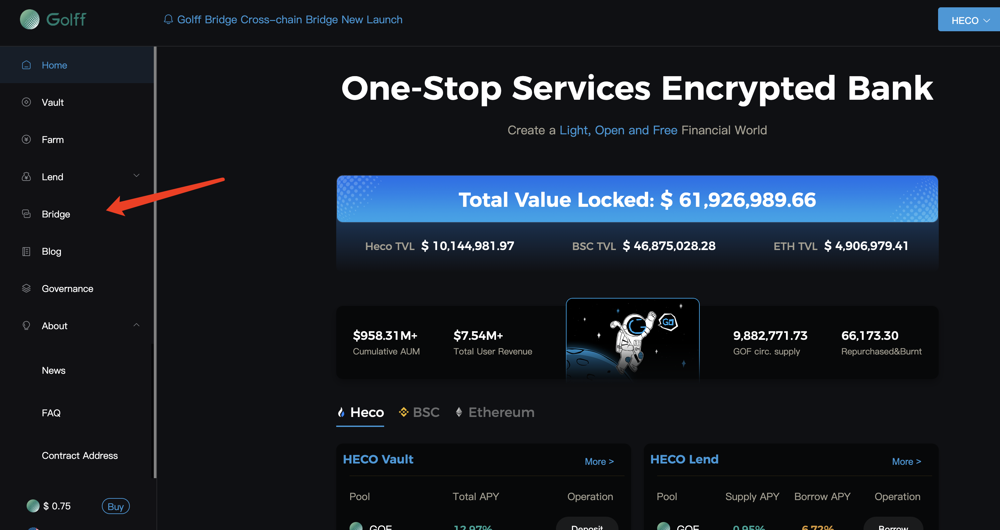
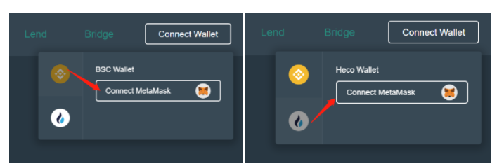
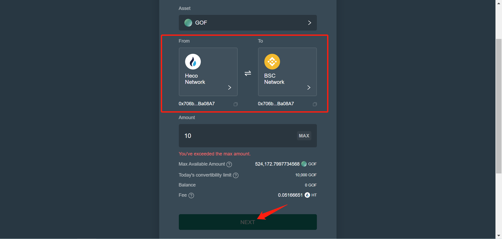
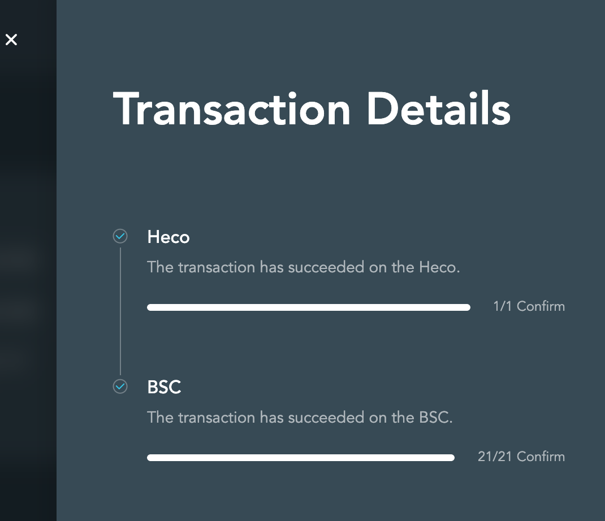

# Golff Bridge Tutorial

## About Golff Bridge

Golff Cross-chain Bridge is officially launched. For your better understanding and use, we will briefly introduce the steps of the Cross-chain Bridge.

At present, Golff product has been deployed on three chains, namely, Ether, Heco and BSC. Using cross-chain bridge can help users realize asset cross-chain, i.e. users transfer assets on one chain to another chain in a fast and low-cost way. Currently Golff cross-chain bridge realizes cross-chain service between  BSC and HECO assets, and supports GOF cross-chain first.

## Tutorial

Example: How GOF on heco chain cross-chain to BSC chain

1. First of all, we use PC browser (cell phone with heco chain wallet) to open [Golff official website](https://golff.finance), after opening, find the cross-chain bridge button and click (or directly visit the cross-chain bridge address: https://bridge.golff.com)

2. After entering the cross-chain bridge page, first connect the wallet, click the "Connect Wallet" button in the upper right corner, you need to connect the BSC chain wallet and Heco wallet, respectively, both chains can complete the connection, as follows.

3. After correctly connecting the wallet, we select the assets that need to cross the chain over (currently only support GOF), we are here from Heco cross chain to BSC, so select From Heco to BSC chain, then enter the amount that needs to cross the chain over, click next to confirm completion.

> ** Note: Daily 8:00 (UTC+8) updates the amount of GOF available for redemption in your account on that day.

4. Wait for the data on the chain to finish synchronization and complete the transfer.

This allows you to view the past assets that just crossed the chain on the BSC of the corresponding address.

Conversely, GOF operates the same way from the BSC to the Heco.