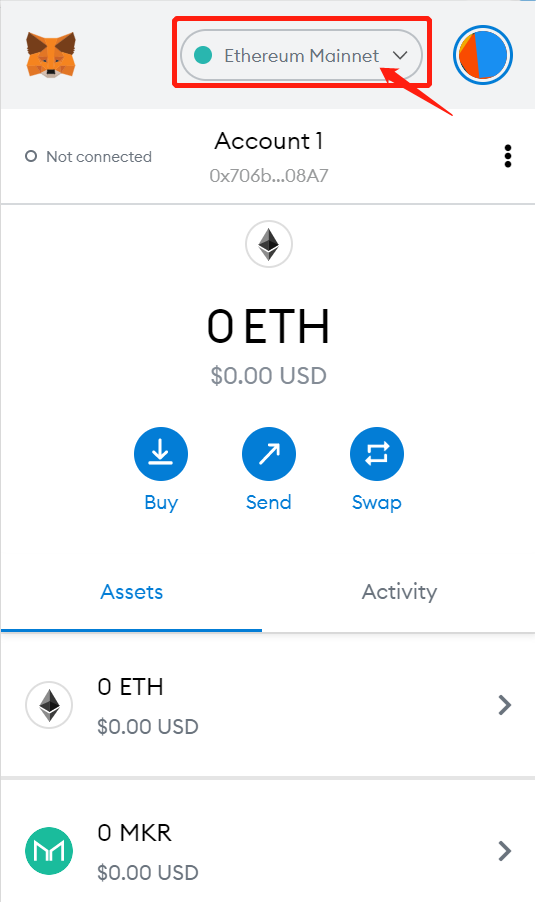
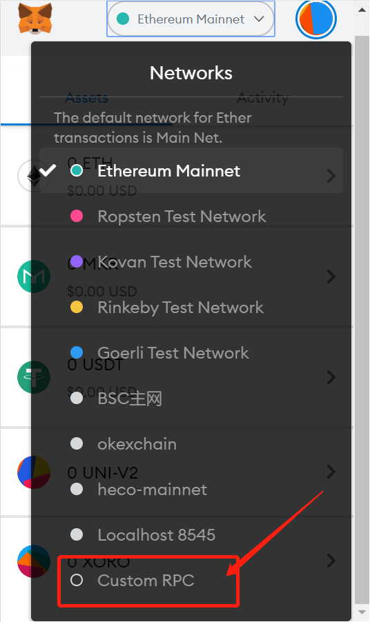

# Heco Tutorial

## MetaMask wallet configuration HECO tutorial

#### Personal Computer

1. Click on the network selection 



2. Custom RPC



3. Adding Website Information
 
**The information is as follows:**
```
- 新增RPC URL: https://http-mainnet.hecochain.com
- Chain ID: 128
- Symbol: HT
- Blocking Manager URL: https://hecoinfo.com/
```
 
3. The information is as follows:


## Mobile wallet access to Golff Heco version tutorial

#### Bitkeep Wallet
1. Download Bitkeep: https://bitkeep.org/
2. Open Bitkeep APP, click "DApp" at the bottom menu, select Heco at the top, or type "golff" in the search box to enter Golff (HECO version)

?> Note: When you use Bitkeep for the first time, you need to add HT to your home page - wallet before you can access heco chain properly.


#### Huobi Wallet
1. Download Huobi Wallet:https://www.huobiwallet.com/
2. Open the Huobi Wallet App and create a HECO wallet.
3. Enter the home page, enter the address in the search box: heco.golff.finance, click enter.
4. Select HECO Wallet and click on the address to go to Golff (HECO version)


#### TokenPocket Wallet
1. Download TokenPocket : https://www.tokenpocket.pro/
2. Go to TokenPocket App and select Heco Chain.
3. Click on "Discover" in the bottom menu, enter heco.golff.finance in the search box and click on it.