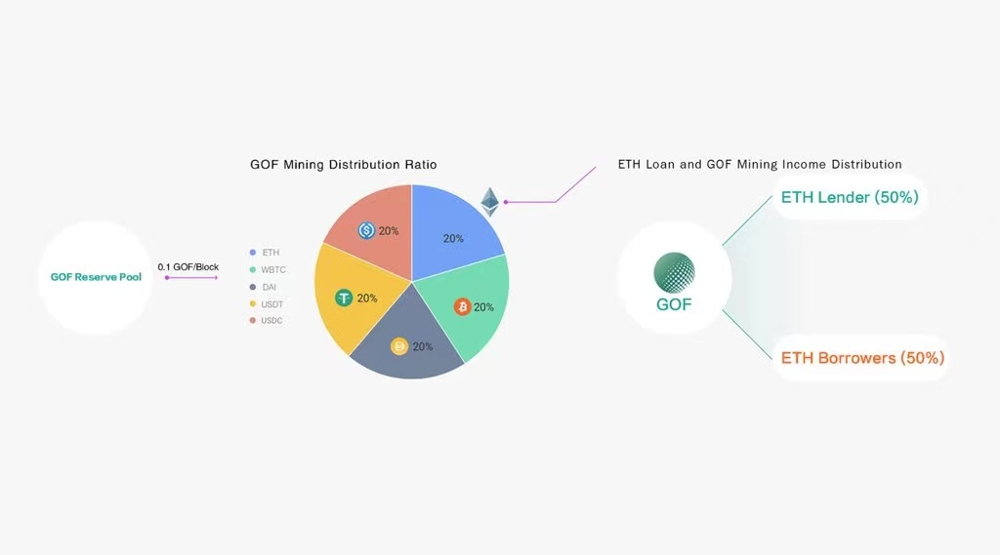
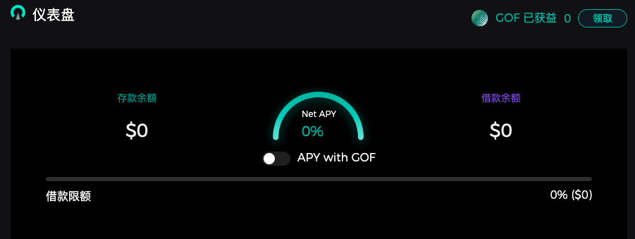

# Golff Lend（Heco）使用教程

## 什么是Golff Lend

Golff Lend为一键式聚合型借贷服务，将陆续聚合当下主流的 DeFi 借贷平台，如AAVE、Compound、dYdX 等。 这将大大扩展可用于借贷的底层资产，增强用户的资产流动性，并且还能优选最佳利率，降低用户的借贷成本。同时Golff借贷未来采用全新的链上手续费替代方案，用于解决常见的以太坊高资金费率问题，大大降低合约调用手续费，降低用户参与的门槛。

通过[Golff官网](https://golff.finance)导航进入借贷页面，或直接访问[产品页](https://heco.golff.finance/lend)并链接钱包（目前支持Metamask、ImToken、BitKeep、火币钱包、麦子钱包、TokenPocket等常规钱包，以下以Metamask为例）。

目前Heco Golff Lend支持的币种有：HT、HUSD、USDT、HBTC、ETH、MDX、HFIL、HBCH、HDOT、HPT、HLTC、UNI、AAVE这13种，我们可以通过在Golff Lend借贷这些币种来进行GOF挖矿。

?> Metamask钱包链接Heco网络教程具体见[MetaMask钱包配置HECO教程](Heco)

## Golff Lend有什么优势
- 增加挖矿机制：增加挖矿收益，存币和借币都可以获得GOF挖矿收益
	- 用户在存币和借币时都可以参与借贷挖矿
	- Heco Golff Lend每周借贷挖矿总量约3480个GOF，按不同比例分配到各个借贷矿池中
- 聚合借贷：V2将陆续聚合当下主流的 DeFi 借贷平台，自动为用户提供全网存币借币利率最优解。
- 借贷机枪池：V3将借贷结合杠杆机枪池挖矿产品，将用户的收益最大化

## 如何存币？

以下以储存USDT为例进行说明:
在供应市场列表中找到USDT币种，点击后出现USDT存币弹窗，第一次操作需要授权Golff Lend的智能合约使用账户中的USDT币种，点击“启用”按钮，在弹出的Metamask钱包窗口中，确认这笔授权交易。

确认完成后，在存入弹窗中输入要存入的USDT的数量，在弹窗中我们可以看到预计年化收益，单个币种的年化收益会随着该币种借出数量的增加而增加，即该币种的使用率越高年化收益越高。输入数量完成后点击“存入”按钮，在弹出的Metamask钱包窗口中，确认这笔存入交易。

存入成功后即可在页面上方看到账户的存款余额。同时你会在账户中收到G-Lendtoken，赎回时需通过G-Lendtoken赎回您的抵押资产。

## 如何抵押？

若要在Golff Lend中借出币种，首先需要在Golff Lend中存入一种资产，并对该资产进行抵押，则可以借出其他的资产。请注意，当抵押品和借出资产价格波动时，抵押资产有可能会在清算中被扣押。

若要抵押资产，则需要在供应市场列表中点击“抵押”开关，开启该币种的抵押。在弹出的界面中点击“使用USDC作为抵押”，然后在弹出的Metamask钱包窗口中，确认这笔操作。

在页面的上方可以看到已存入的资金和已借出的资金，以及当前的可贷款限额

## 如何借币？

在借贷市场中，选择要借出的币种，点击列表出现借币弹窗，输入要借出的币种数量，点击“贷款”按钮，然后在然后在弹出的Metamask钱包窗口中，确认这笔操作。待链上操作完成后，您将会在钱包中收到借出的币种。

## 如何偿还？

在借贷市场中点击正在借款中的币种，在弹窗中选择“还款”操作，输入要还款的数量，并点击“还款”按钮，并在Metamask钱包中确认该笔交易。待链上操作完成后，会在页面上看到可借出的代币数量增加。

还款完成后可以将抵押品进行赎回，在供应市场中选择币种，并在弹窗中选择“提现”操作，输入要提现的数量，点击“提现”按钮，并在Metamask钱包中确认该笔交易。若资产正在抵押中或可提现的金额不足，则无法进行提现操作。

## 清算机制

借款人在借款时候，需要在Golff Lend中抵押一定的资产，借款人可以借款的金额由抵押系数，即贷款上限为：抵押资产价值x抵押系数。

当抵押品和借出资产价格波动时，抵押资产有可能会在清算中被扣押。因此Golff Lend会实时监控每一个借款账户，当借出资产超过贷款上限时，用户的借出资产将有被清算的风险。

此时用户可作为清算人触发清算程序，可以以一定的折扣获得抵押品，由此，借款人偿还了 DeFi 借贷系统的贷款，避免 DeFi 借贷平台出现债务和坏账，维持了系统的偿付能力，同时，清算人获得了收益，平台也行以正常运行。

例如A用户存入10000U价值的USDT并进行抵押借贷，借出5了个ETH，此时5个ETH价格上涨至7500U，A用户的资产触发了清算边界。此时清算人B对此进行清算，他替A用户偿还了2.5个ETH（单次清算最高限额为借款金额的50%），他可以获得清算金额*108%对应的G-LendUSDT。