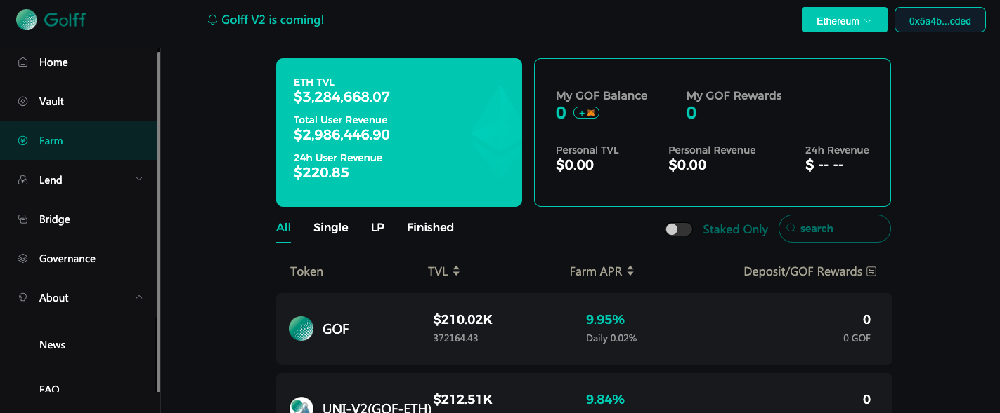

# Heco Golff Vault Tutorial

## What is Heco Golff Vault

Heco Golff Vault is an intelligent earnings aggregator (Earn Collection) based on the Firecoin ecosystem chain, based on the DeFi protocol that automatically achieves the best earnings strategy configuration. It provides investors with one-click access to the best returns on the Heco chain, thus greatly reducing the barrier to entry for ordinary investors while reducing the loss of returns due to information asymmetry.

## What are the benefits of Heco Golff Vault

1. Eliminating the complex contract operation link of liquidity mining, the Heco version of Golff Vault helps users save more on contract operation fees, users only need to top up assets to the Golff Vault Heco version of smart contracts as an agent and top up/withdraw with one click to get the best returns in the market.
2. The front-end is developed by the core team of more than 10 full-time contract engineers, and each contract is audited by a globally renowned security company for code auditing to ensure the maximum security of the contract. Meanwhile, Golff's team of community engineers is gradually being formed, and we welcome all outstanding developers to join Golff's contract development and auditing. In the future, Golff's insurance products will also support contracting with strategies in the Heco Golff Vault, further reducing possible risk losses.
3. Market information collection by more than 20 strategy analysts in the community to be the first to identify high-yielding strategies and submit them to the contract group for development. Compared to the original Golff Vault V2, the Heco version of the Vault will switch strategies more frequently and put money from the Vault pool into higher-yielding strategies in the fastest way possible.
4. Heco Golff Vault is a smart contract governed by Golff DAO, with funds decentralized and hosted by the contract, without the need to trust third parties.
5. Automatic rebalancing of yield strategies: the Heco Golff Vault Vault pool automatically switches strategies based on current market conditions. For a particular coin, users do not need to withdraw coins and recharge to a new pool to get the highest returns in the current market. The only pool for each cryptocurrency is the highest yielding Vault in the current market
6. The latest version of Heco Golff Vault will add an automatic reinvestment feature to help users maximize their capital without additional actions

## How to use Golff Vault 

1. Open the official website, prepare the wallet and sufficient tokens, need to prepare some HT for contract fees. (Need to switch Metamask/mobile wallet to Heco network, switching tutorial)
Heco Golff Vault participation address: https://heco.golff.finance/vault 
2. Select the coins to participate in the pledge, currently supported: USDT, SKM, LAVA, HT, HUSD, HBTC, ETH, HDOT, HFIL, HLTC, HPT, MDX, BCH, UNI (more coins will be supported in the future) 
3. Authorize the wallet for the cryptocurrency before depositing 
4. Then enter the quantity and click "Deposit" (you can also click "Deposit All") to start Golff Vault mining and get the best profit in the current market. 
5. After successful deposit, you will receive the corresponding number of G-HecoTokens in your on-chain wallet, you can check the G-HecoToken balance in the Heco browser or add the corresponding coin contract address to your wallet. 
6. Enter the amount and click "Withdraw" or "Withdraw All" to receive the amount of G-HecoToken that can be redeemed in the Vault pool. 

## Participate in mining with G-HecoToken

1. Open the Farm interface, which can be accessed directly at https://heco.golff.finance/farm, or on the Pool participation page

2. Select the corresponding pool and click it, then deposit the G-HecoTokens obtained by participating in the Vault

3. Enter the number of G-HecoTokens deposited and click on Deposit.

?> 注意：Note: After G-HecoToken is deposited into the Farm pool, the available balance in the Farm pool page will be displayed as 0. If you need to retrieve the principal, you need to retrieve the G-HecoToken in the Farm pool first before you can see the corresponding principal and earnings.

## Revenue Distribution

The proceeds of various cryptocurrencies generated in the Heco Golff Vault pool are automatically put into the Vault pool, of which 91% of the proceeds are allocated to the fund contributors and the remaining 9% is used to repurchase GOF in the secondary market, of which 4% is for the community developer fund, 4% is destroyed, 1% is for the risk reserve, and the harvest contract call fees are borne by the developer fund. The risk reserve is used to cover losses incurred by Vault investors due to unforeseen risks. Secondary market repurchases will be made in the DEX, and the DEX where the main repurchase operation will be conducted will be announced before the repurchase.

The whole process of revenue generation and distribution is realized on the chain through smart contracts, which are completely open and transparent and subject to community-wide oversight. In the future, the main parameters of the revenue distribution can be changed through the community's voting governance.