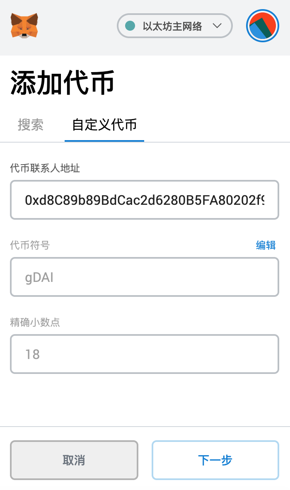

# Golff Vault-机枪池使用手册

## 什么是Golff Vault
Golff Vault就是一个智能化的收益聚合器(Earn Collection), 基于自动实现最佳收益策略配置的DeFi协议。它能够帮助投资人一键获取市场最优收益，从而在大大降低普通投资者进入门槛的同时，能减少因信息不对称而导致的收益损失。

## Golff Vault V1有哪些优点
1. 免去流动性挖矿复杂的合约操作环节，节省用户高昂Gas费用，只需充值资产给Gollf Vault智能合约作为代理，一键充值/提现，就能获得市场上最佳收益
2. 前期由核心团队的10多位全职合约工程师进行开发，并且每个合约都经过两家以上的全球知名安全公司进行代码审计，最大程度上保证合约的安全。同时，Golff的社区工程师团队也在逐步组建，我们欢迎所有的优秀开发者加入Golff的合约开发和审计中来。未来，Golff的保险产品也会支持对与Golff Vault中的策略进行承包，进一步减少可能的风险损失。
3. 由社区内20多位策略分析师进行市场信息收集，第一时间发现高收益策略，并提交合约组进行开发
4. Golff Vault 是由 Golff DAO 治理的智能合约，资金由合约去中心化托管，无需信任第三方

## Golff Vault V1产品的一些特殊功能
1. **资金权重线性释放：** 为防止大户通过快速存入并提取资金的方式来稀释其他人的收入，所有收益将在每次存入资金后的24小时内被均匀释放，因而只有在一天后才能领取到全部收益。注意：每次存入资金都会重新开始计算24小时倒计时。例如，一个用户在充值6小时后就领取，则只能领取当前收益的1/4
2. **收益策略自动再平衡：** 根据当前市场情况，Golff Vault机枪池会自动切换策略。对于某个币种来说，用户无需提币再充值到新池子，即可获得当前市场最高收益。每个币种的唯一池子就是当前市面上最高收益的Vault 
3. **Harvest触发者激励制度：** 任何用户都可以使用 Harvest 功能来收割粮食，收割者可以获得池内GOF奖励的1%，收割费用大概0.05eth左右，频繁调用 Harvest 有助于减少收割时产生的滑点，增加机枪池用户整体收益。频繁调用有助于减少收割时产生的滑点，增加Vault用户整体收益。注意要有足够收益后再进行，否则利润不够cover手续费。同时要注意观察该地址交易，看一下有没有其他人也在调用，只有第一个成功调用的人才能获得最大Harvest收益。

## Golff Vault机枪池使用流程
1. 打开[官网](https://app.golff.finance/vault)，准备钱包和充足的代币，需准备一些ETH作为合约手续费
2. 选择要参与质押的币种


3. 在左侧栏目内先进行钱包授权

然后输入数量，点击“存入”（也可以一键点击“全部存入”），即可开启Gollf Vault挖矿，获得当前市场上的最佳收益



存入成功后，链上钱包中会收到对应数量的GToken，可以在以太坊区块浏览器上查看，或者在钱包中添加对应币种合约地址查看：

**GDAI合约地址**
```
0xd8C89b89BdCac2d6280B5FA80202f9213b37A0F3
```
**GYCRV合约地址**
```
0xc63dAc4501665E64c7ae60b5860bBC0188687716
```

4. 领取收益需等待24小时，即可无损提取全部利息，输入数量点击右侧“提取”或点击“全部提取”。（假如用户在充值6小时后就领取，则只能领取当前收益的1/4，注意：每次充值后会重新开始计算24小时）
或者点击领取GOF收益，即可领取利息，本金继续参与Gollf Vault挖矿

5. 全网领取：任何用户都可以使用 Harvest 功能将Vault池内所有已经产生收益的部分从目标项目中进行领取，通过DEX自动转换成GOF，进入储备池，触发“全网领取”的收割者可获得池内GOF奖励的1%作为手续费补贴


## Vault V1收益分配
Golff Vault池子中产生的各种加密货币的收益会在DEX中全部兑换成GOF，95%分配给资金投入者，1%为风险储备金，1%harvest，3%用于在二级市场回购GOF并进入Vault基金池（用途后续由社区投票决定）。风险储备金用于弥补因不可预见的风险而给Vault投资人带来的亏损。二级市场的回购会在DEX中进行，在回购前会公布主要进行回购操作的DEX。

收益的产生和分配全过程通过智能合约在链上实现，完全公开透明，接受全社区的监督。未来可以通过社区的投票治理去更改收益分配中的主要参数。


## 关于GToken

#### 1.什么是GToken？

GToken是GOF 核心业务机枪池（Vault）的权益Token。GToken承载了GOF 的核心业务价值，将投资者存入GOF Vault的普通Token转化为权益证明GToken。同时GToken符合ERC20标准，可用于与其他DeFi产品进行乐高式组合，生成更为复杂的DeFi衍生品。

#### 2.GToken的机制是怎样的？

机枪池（Vault）内每个币种均对应于一个专属GToken，如DAI机枪池产生的权益GToken为GDAI，代表了用户对机枪池内DAI资产的权益份额。DAI与GDAI 1:1 锚定。

#### 3.具体产品设计上有哪些特性？

用户资金进入机枪池后，会自动配置该币种下最优挖矿策略，在保证本金安全前提下进行最高收益挖矿。其利润的95%将通过DEX将收益兑换成GOF：
- Harvest收割奖励 1%，用于补贴收割gas费用。频繁调用 Harvest 有助于减少收割时产生的滑点，增加机枪池用户整体收益。
- 风险储备金为1%，风险储备金用于弥补因不可预见的风险而给Vault投资人带来的亏损。
- 3%用于在二级市场回购GOF进入Vault基金池，用途后续由社区决定。二级市场的回购会在DEX中进行，在回购前会公布主要进行回购操作的DEX。

#### 4.GToken的应用?

- GToken将用户的机枪池权益从单一的充值与提现中解放出来，转化为一种可流通的资产。类似于Uniswap的LPT或者Balancer的BPT，可以在支持这些GToken的项目中使用。比如可以抵押GDAI进入Golff的Farm流动性矿池，来获得额外的GOF奖励。
- 交易所可建立GToken相关的币币交易对，转由二级市场完成GToken的兑换。