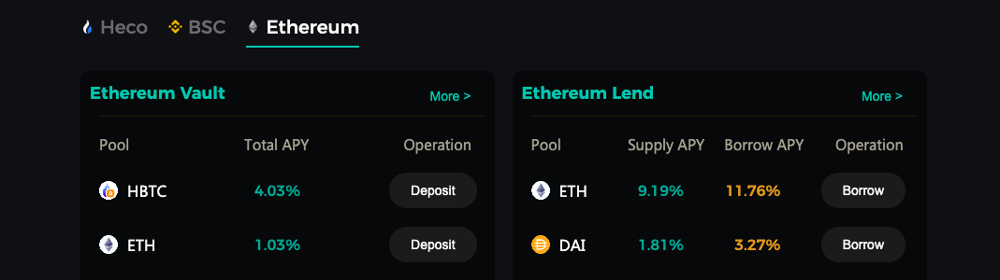
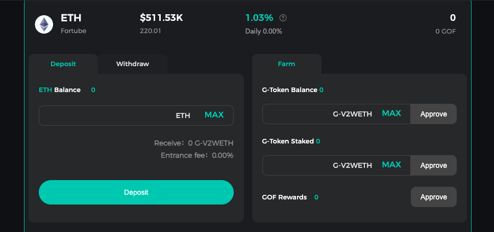
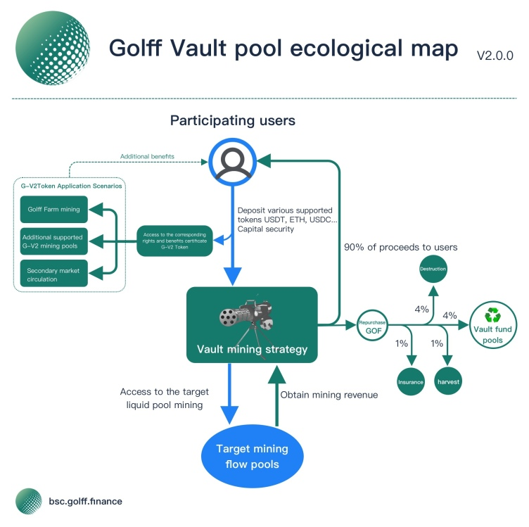

# Vault V2 Tutorial

## What is Golff Vault

Golff Vault is an intelligent Earn Collection, based on the DeFi protocol that automates the allocation of optimal earnings strategies. It helps investors to access the best returns in the market with one click, thus greatly reducing the barrier of entry for ordinary investors while reducing the loss of returns due to information asymmetry.

## What are the advantages of Golff Vault V2？

1. Eliminate the complicated contract operation link of liquidity mining, save users high Gas fees, just top up assets to Gollf Vault V2 smart contract as a proxy, one click to top up/withdraw, and you can get the best return in the market
2. The front-end is developed by the core team of more than 10 full-time contract engineers, and each contract is audited by more than two globally renowned security companies for code audit to ensure the security of the contract to the maximum extent. Meanwhile, Golff's team of community engineers is gradually being formed, and we welcome all outstanding developers to join Golff's contract development and auditing. In the future, Golff's insurance products will also support contracting with the strategies in Golff Vault V2 to further reduce possible risk losses.
3. Market information collection by more than 20 strategy analysts in the community to identify high-yielding strategies first and submit them to the contracting group for development
4. Golff Vault V2 is a smart contract governed by the Golff DAO, with funds decentralized and hosted by the contract, eliminating the need to trust third parties
5. Automatic rebalancing of yield strategies: Based on current market conditions, Golff Vault V2 Vault pool will automatically switch strategies. For a particular coin, users do not need to withdraw and recharge to a new pool to get the highest returns in the current market. The only pool for each coin is the current highest yielding Vault in the market.

## How to use Golff Vault
1. Open the official website https://app.golff.finance/vault, prepare your wallet and sufficient tokens, you need to prepare some ETH as contract fees

2. Select the coins to be pledged

3. Authorize the wallet for the coins before depositing

4. Then enter the quantity and click "Deposit" (you can also click "Deposit All") to start Golff Vault mining and get the best return in the current market. After successful deposit, you will receive the corresponding number of G-V2Tokens in your on-chain wallet, you can check the balance of G-V2Token on the Ethernet block browser, or add the corresponding coin contract address in your wallet.

5. Enter the amount and click "Withdraw" or "Withdraw All" to receive the number of G-V2Token in the Vault pool.

## Revenue Distribution

The proceeds of various cryptocurrencies generated in the Golff Vault pool are automatically placed in the Vault pool, of which 90% of the proceeds are distributed to the fund contributors and the remaining 10% is used to repurchase GOF in the secondary market, of which 4% is for the Community Developer Fund, 4% is destroyed, 1% is for the risk reserve and 1% harvest contract call. The risk reserve is used to cover losses incurred by Vault investors due to unforeseen risks. Secondary market repurchase will be conducted in DEX, and the DEX where the main repurchase operation will be conducted will be announced before the repurchase. The whole process of revenue generation and distribution is realized on the chain through smart contracts, which is completely open and transparent and subject to the supervision of the whole community. In the future, the main parameters of the revenue distribution can be changed through the community's voting governance.

## About G-V2Token

#### 1.What is G-V2Token?

G-V2Token is the equity Token of Golff's core product business, Vault V2 (Vault Pool), which is an upgraded version of the original GToken. optimizing revenue strategy to continuously enhance the value of G-V2Token. At the same time, G-V2Token is ERC20 compliant and can be used for Lego-style combinations with other DeFi products to generate more complex DeFi derivatives. 

#### 2.Why did you develop G-V2Token and what are the benefits for Golff?

The Golff Vault pool inevitably requires users to lock the corresponding Tokens in the pool for strategy execution, and users will withdraw funds due to various needs, resulting in Golff Vault outflows. The G-V2Token mechanism ensures that the value of the G-V2Token is always higher than that of the Token, and will continue to grow. When users need funds, they do not need to withdraw the principal from the Vault pool, but can simply use the G-V2Token to trade directly into Tokens on platforms such as Uniswap. At the same time Golff Vault has optimized its functions and made precautions against lightning loans and the dilution of equity in the pool by giant whales, so that the interests of investors are fully protected. 

#### 3.What is the mechanism of G-V2Token and how does it differ from GToken?

Each coin in Golff Vault 2.0 (Vault Pool) corresponds to an exclusive G-V2Token, for example, the equity G-V2Token generated by the ETH Vault Pool is G-V2ETH, which represents the user's equity share of the ETH assets in the Vault Pool. Since the Golff Vault Pool uses a principal-free strategy, the proceeds of the target pool will be automatically converted to costcoin Tokens by the contract, and the number of G-V2Tokens will remain unchanged due to the ongoing proceeds put into the pool, the more Tokens the user can exchange by virtue of the G-V2Token, the more the G-V2ETH price will continue to increase relative to the ETH exchange rate. The new features of G-V2Token will facilitate the circulation of G-V2Token in the secondary market instead of the original Token. The new features of G-V2Token will facilitate the circulation of G-V2Token in secondary market instead of the original Token. 

#### 4.How will Golff Vault V2 proceeds be distributed？

After the user funds enter the Vault pool, the optimal mining strategy under the coin will be automatically configured, and the highest revenue mining will be conducted under the premise of ensuring the safety of the principal. 90% of its profit will be converted to costcoin into the pool through DEX, and the remaining 10% will be used to repurchase GOF in the secondary market, with the following allocation. 

- Harvest harvesting bonus 1% to subsidize the cost of harvesting gas. Frequent calls to Harvest help reduce the slippage generated during harvesting and increase the overall revenue of the Vault pool users.
- Risk reserve of 1%. The risk reserve is used to cover losses to Vault investors due to unforeseen risks.
- 4% is used to repurchase GOF in the secondary market to enter the Vault pool, the use of which is subsequently determined by the community.
- The 4% repurchased GOF will be directly destroyed.