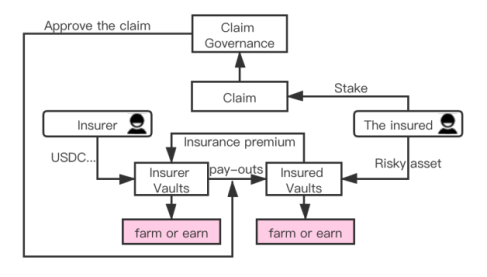

# Golff简介

?> DeFi聚合器平台，一站式加密银行！

## Golff的诞生与愿景
DeFi是继比特币之后，去中心化世界里真正意义上的第一个应用。我们坚信DeFi终有一日会走出Crypto圈子，成为开放金融的弄潮儿！Golff团队成员深耕区块链已久，拥对行业敏锐的洞察力、踏实的实干精神。我们一直坚信，每个人都应享有平等接触优质金融产品和服务的机会。Golff由此诞生！
Golff旨在打造一站式加密银行，致力于创造人人皆可以参与的轻量、开放、自由的金融世界。此时，我们正站在 DeFi 爆发的起点，面对 DeFi 世界的浩大未来。

## Golff 为 DeFi 市场带来全新的产品机制与体验
#### 1.低门槛，快速、流畅的产品体验
“傻瓜式”产品体验，降低用户门槛，让用户顺滑走完产品流程。同时， Golff 还采用了两种方案去提速解决以太坊堵塞而影响用户体验的问题。 方案一是使用 Rollup 类型的二层网络 (Layer2) 扩展， 方案二是通过跨链支持性能更好的公链，如 GXChain。
#### 2.多版本、本土化产品设计，同时捕获东西方用户
DeFi 产品天然就是一个没有国界的开放金融体系，来自各国的用户共同参与，为了给各国的用户提供适应他们各自文化与使用习惯的产品体验， Golff将针对东西方用户分别推出具有更符合本土化体验和 UI 设计的产品。 这也让 Golff在产品体验上能力压竞争对手，吸引来自全世界的用户与资 金进入。
#### 3.创新玩法，增强收益的同时提升用户粘性
Golff 作为 DeFi 聚合器，在优选聚合 DeFi 产品组合以优化收益的同时， 还会持续地创新产品设计与玩法。让用户在获得金融收益的同时还有社 交属性以及类游戏性质的体验，从而去大幅提升用户的粘性。
#### 4.全线产品，打造链上金融巨头
一个 DeFi 产品就是一个资金的容器，资金规模的大小很大程度上决定了 这个应用的价值。想要在一个 DeFi 容器里留住更多的资金，很重要的一点就是能满足资金的不同需求。因此 Golff 打造的是一站式的 DeFi 产品， 满足资金全方位的金融需求，包含流动性挖矿、理财、保险、借贷、衍生品等。

## Golff产品矩阵
#### 1.Fantastic Farm 流动性挖矿
Golff 第一阶段会通过流动性挖矿的方式产生初始治理代币 GOF，吸引大量的“矿工”和“农民”参与进来。流动性挖矿产生初始治理代币是一种更为公平、透明的方式，并且能快速帮 Golff 获取初始用户。 在 Golff 的后续产品推出时，都会加入各种形式的挖矿代币激励方式。
Golff 的流动性挖矿将会分为多阶段进行，在挖矿获得高收益的同时有更强的游戏体验感与趣味性，激励用户更多与更持续的参与。 流动性挖矿的具体规则会在之后有专门的文档进行介绍。
#### 2.Golff Vault 收益聚合器
Golff Vault 是一款自动选取可获得最高收益的收益聚合器，虹吸各 DeFi 产品价值，其目标是以一种无损方式为持有资产赚取最大化收益。Golff Vault 会基于程序化筛选自动提供被认为是当下市场最优的收益策略列表同时也会发现跨协议套利机会 , 这一过程实际上是聚合了当前市场中的各个 DeFi 产品。另外，Golff Earn 还允许用户自行提供策略（需持有一定的 GOF）, 经过社区投票被通过成为可选择收益策略后，策略
提出者可共享策略池中的收益。

#### 3.Financial Enhancement Insurance 理财增强型保险

Golff 的保险业务，在保险的基础上，增加了承保池和被保险池的聚合型 farm 和 Vault, 这让承保人在获得基础保费收益的基础上能获得额外的收 益，同时也让被保险人在获得风险转移的基础上能获得一定收益。参与 Golff的保险无需进行KYC，承保的业务范围包含链上合约以及链上资产， 即可以对合约安全事故风险以及资产的信用风险进行承保。 承保人只需 往“承保池”中存入稳定价值的资产，即可成为承保人。被保险人只需往“被 保险池”中存入风险资产，即可买入保险。被保险池中将会定期支付资金给承保池作为保费。当风险发生时，被保险人可向索赔委员会提出申请 索赔，索赔申请通过后，承保池中相应的资产便会支付给被保险池。

#### 4.Lighting Lend 一键式聚合借贷

Golff推出的一键式聚合型借贷服务，能聚合当下主流的 DeFi 借贷平台，如MakerDAO、Compound、Dharma、dYdX 等。 这将大大扩展可用于借贷的底层资产，增强用户的资产流动性，并且还能优选最佳利率，降低用户的借贷成本。同时，链上借贷行为的发生，以及良好的还款表现，都能作为”信用行为“ 而参与挖矿。Golff团队目前正在联合 GXChain 团队研究基于可信预言机而实现的链上无担保信用贷款协议，这能打开新的链上借贷市场，大幅提升链上借贷规模。该产品目标通过 可信计算，将链下中心化数据提供商的数据脱敏计算出消费者信用风险 后，传入信用贷款协议，连接链下信用行为与链上金融行为。