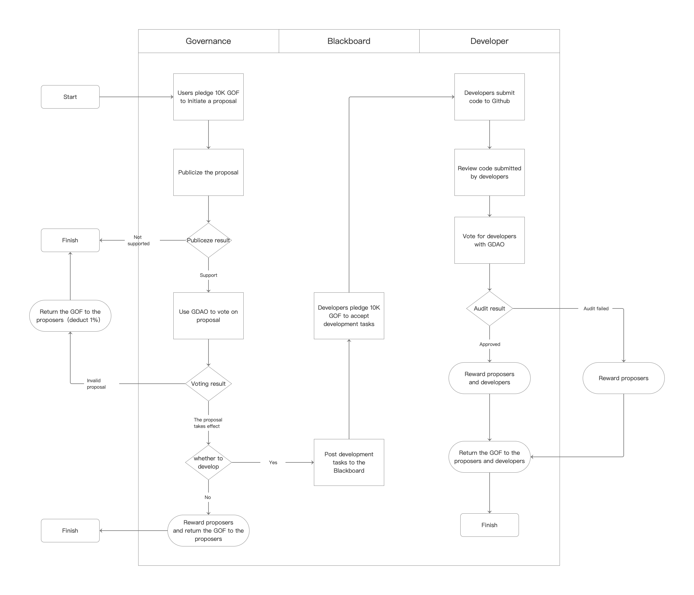

## Community Governance Proposal Process

A complete Golff community governance proposal requires a 4-step process.

1. Proposal Generation
2. Proposal Publicity and Optimization

3. Proposal Referendum

4. Proposal implementation and monitoring

   

## Proposal Generation

Purpose of this step: Identify optimization points and problems of the Golff project, and find solutions to help the project grow better

How to achieve this: Community members, while participating in community discussions and exchanges, discover the points where Golff projects can be optimized and explore to find solutions, initially forming proposals. By pledging 10,000 GOF and choosing categories (development, strategy, product, community operation, content output, brand cooperation, etc.) according to the proposal template and setting GOF rewards, we can launch proposals in the community.

## Proposal Publicity and Optimization

**Purpose of this step:** The initial proposals formed by the community often have shortcomings, and during the public period, more people in the community can participate in the discussion, so as to optimize the content of the proposal.

**How to achieve:** After the community has fully discussed the proposal, the proposal can be publicized in the Golff Vote board for 48 hours. During the public period, community users can continue to leave comments and suggestions for optimization and reasonable discussion, and if there is no objection, they can vote for the proposal. If the proposal is flawed, the proposal sponsor can delete the original proposal and re-initiate the proposal for the corresponding publicity. The proposal will be approved only after 48 hours of publication and more than 10 people support it. If the proposal fails to be announced, the GOF pledged by the sponsor will be returned (less 1%). If the proposal is found to be politically sensitive or insulting during the publication period, GTEAM reserves the right to stop publishing the proposal on the Vote board.

## Proposal Referendum

**The purpose of this step:** The proposal will be widely voted on in the community so that the final approved proposal is representative of the majority of GDAO-owning users.

**How to achieve this:** The proposal will be publicly voted on in the Golff Vote board, where all GDAO holders can vote on the proposal. If the proposal fails, the GOF pledged by the proposer will be returned (minus 1%).

**Proposal Passage Determination:** A proposal referendum passage must meet the following conditions at the same time.

1. the proposal has undergone a 48-hour public disclosure process

2. the voting period is at least 24 hours

3. the number of GDAOs voting exceeds 4% of the total number of GDAOs currently in circulation

4. the ballot is approved

   

## Proposal implementation and monitoring

The purpose of this step: the proposals voted by the community need to be executed by the community developers and DAO members to be monitored by the community.

Implementation method.

1. The proposals voted by the community will be automatically entered into the Job List according to the task type (development, strategy, product, community operation, content output, brand cooperation, etc.)\2. All community developers can receive tasks by pledging 10,000 GOF, and tasks can be received and executed by multiple developers

3. After completing the task, developers will submit the code or detailed operation execution plan to the platform, and GDAO members with 500k+ can vote on the code submitted by different developers

4. After the task is approved, the GOF pledged by the proposer and the developer will be returned, and the GOF pledged by the proposer will be rewarded at 5%, and the developer will be rewarded according to the development difficulty. If the task is not approved, the GOF pledged by the proposer and the developer will be returned.

