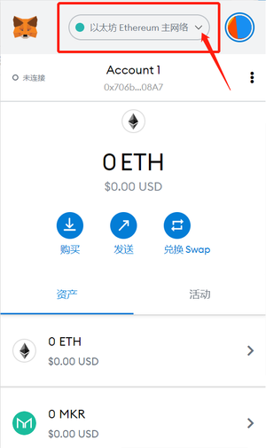
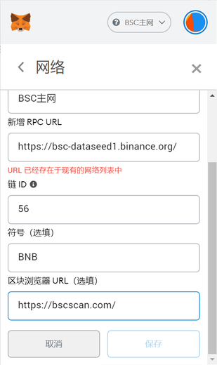
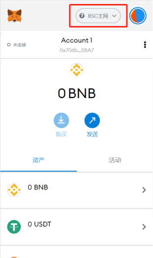

# BSC相关操作手册

## MetaMask钱包配置BSC教程

#### PC端

1. 点击⽹络选择



2. ⾃定义 RPC


3. 添加⽹络信息


 
**信息如下：**
```
- 网络名称：BSC主网
- 新增RPC URL：https://bsc-dataseed1.binance.org/
- 链ID：56
- 符号：BNB
- 屏蔽管理器URL：https://bscscan.com/
```
 
3. 选中⽣态链主⽹⽹络 

