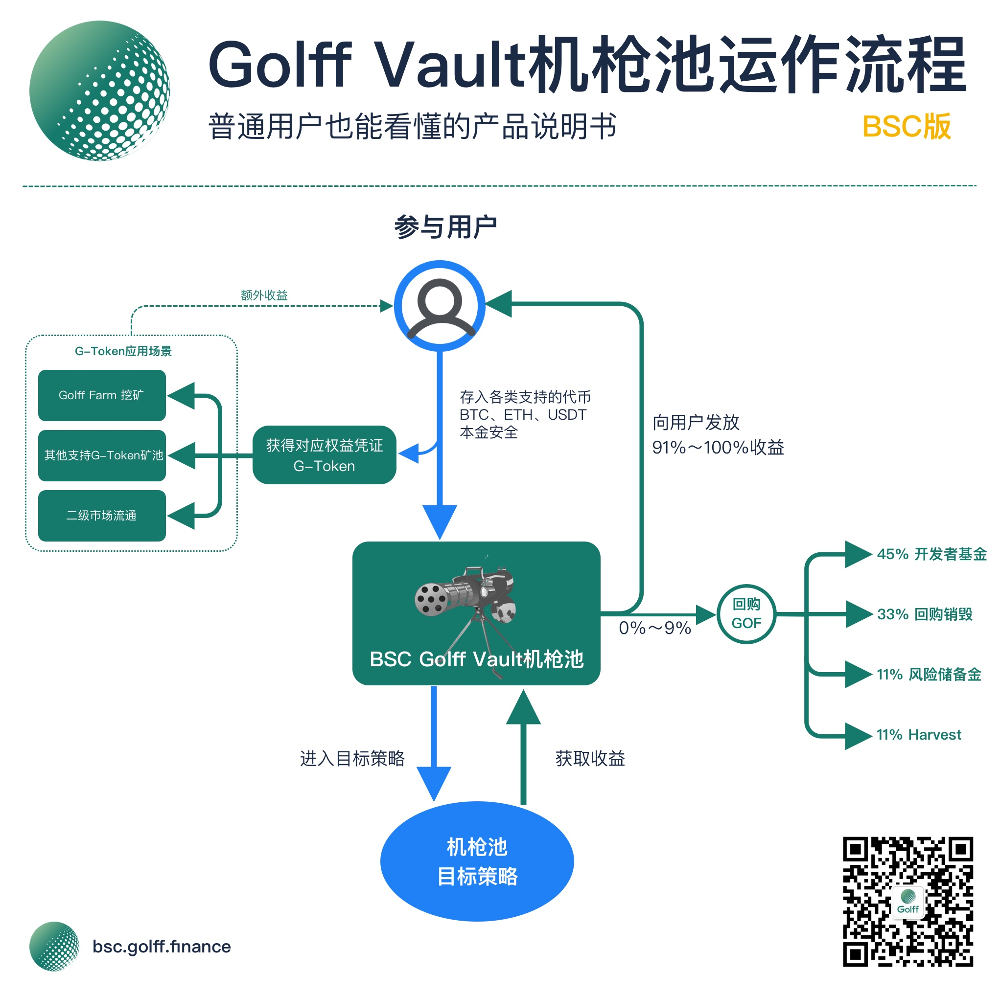
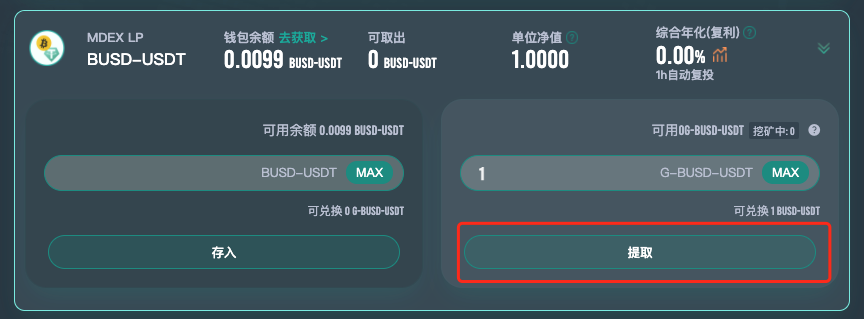

# BSC Golff Vault机枪池产品操作手册

## 什么是BSC Golff Vault

BSC Golff Vault是一个基于币安智能链的智能化收益聚合器(Earn Collection), 是基于自动实现最佳收益策略配置的DeFi协议。它能为投资人一键获取BSC链上最优收益，从而在大大降低普通投资者进入门槛的同时，能减少因信息不对称而导致的收益损失。

## BSC Golff Vault有哪些优点
1. 免去流动性挖矿复杂的合约操作环节，BSC版本的Golff Vault可以帮助用户节省更多合约操作手续费，用户只需充值资产给Gollf Vault BSC版智能合约作为代理，一键充值/提现，就能获得市场上最佳收益；

2. 前期由核心团队的10多位全职合约工程师进行开发，并且每个合约都经过全球知名安全公司进行代码审计，最大程度上保证合约的安全。同时，Golff的社区工程师团队也在逐步组建，我们欢迎所有的优秀开发者加入Golff的合约开发和审计中来。未来，Golff的保险产品也会支持对与BSC Golff Vault中的策略进行承包，进一步减少可能的风险损失；

3. 由社区内20多位策略分析师进行市场信息收集，第一时间发现高收益策略，并提交合约组进行开发，相比原先的Golff Vault V2，BSC版的Vault支持的策略会更加的丰富，最快地为用户寻找最新最优质的策略；

4. BSC Golff Vault是由 Golff DAO 治理的智能合约，资金由合约去中心化托管，无需信任第三方；

5. 收益策略自动再平衡：根据当前市场情况，BSC Golff Vault部分机枪池会自动切换策略。对于某个币种来说，用户无需提币再充值到新池子，即可获得当前市场最高收益。

6. 最新版本的BSC Golff Vault将支持自动复投功能，在用户无需额外操作的情况下，帮助用户的资金达到利益最大化

## Golff Vault机枪池使用流程：
1. 打开[官网](https://bsc.golff.finance)准备钱包和充足的代币，需准备一些BNB作为合约手续费。（需要将Metamask/移动端钱包切换至BSC网络，[切换教程](/zh-cn/BSC)）

2. 选择要参与质押的币种，目前已支持：

单币：GOF、MDX、CAKE、USDT、BNB、BTC、BUSD、ETH、USDC

MDEX LP：BTCB-USDT、ETH-USDT、BUSD-USDT、WBNB-BUSD

Pancake LP：CAKE-BNB、BUSD-BNB、ETH-BNB、BTCB-BNB、USDT-BUSD、USDT-BNB、USDC-BUSD

3. 存入前先对币种进行钱包授权

然后输入数量，点击“存入”，即可开启Gollf Vault挖矿，获得当前市场上的最佳收益

4. 存入成功后，链上钱包中会收到对应数量的G-Token，可以在BSC浏览器上查看G-Token余额，或者在钱包中添加对应币种合约地址查看，每一个G-Token代表了您在该Vault池中可领取的资金份额。同时可以蒋G-Token存入到矿池中获得额外的GOF挖矿收益。

5. 输入数量点击“提取”，即可领取对应G-Token在该Vault池中可兑换的Token数量，若资金在矿池中，需要先将G-Token先从矿池中取出，页面中会显示在挖矿中的G-Token数量。（部分机枪池策略存入可提现均需要支付手续费，实际以链上到账金额为准，Golff平台在存取操作时不额外收取手续费，具体费用请以页面提示为准）

## 收益分配：
BSC Golff Vault池子中产生的各种加密货币的收益会自动放入Vault资金池，其中91%～100%收益分配给资金投入者，剩余0%～9%用于在二级市场回购GOF，其中回购部分的45%为社区开发者基金，33%销毁，11%为风险储备金，11%为harvest合约调用手续费。风险储备金用于弥补因不可预见的风险而给Vault投资人带来的亏损。二级市场的回购会在DEX中进行，在回购前会公布主要进行回购操作的DEX。（由于当前BSC链GOF

收益的产生和分配全过程通过智能合约在链上实现，完全公开透明，接受全社区的监督。未来可以通过社区的投票治理去更改收益分配中的主要参数。