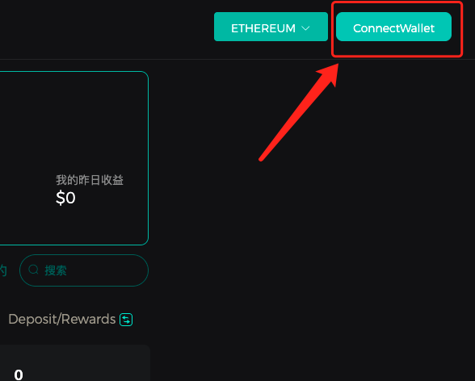
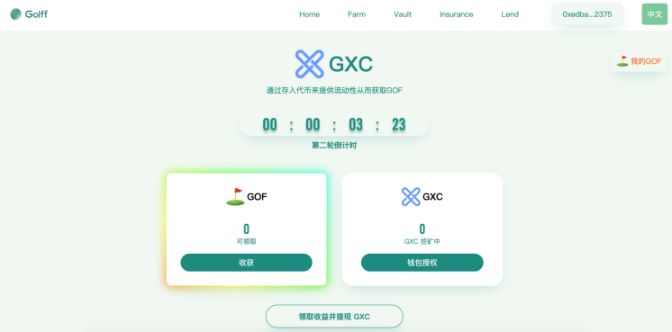
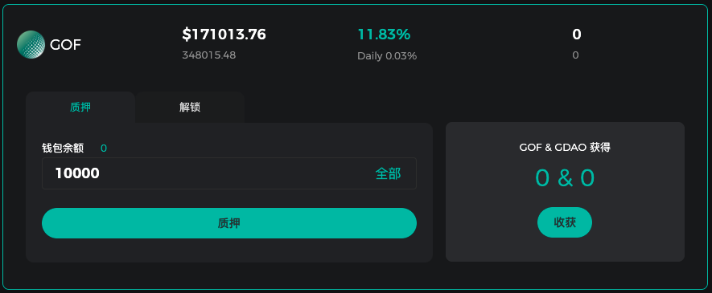
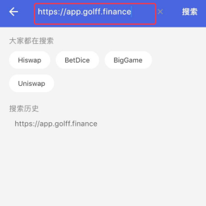
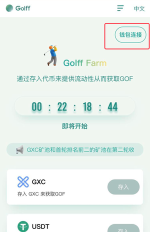
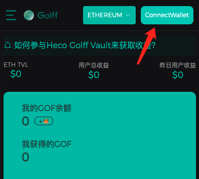
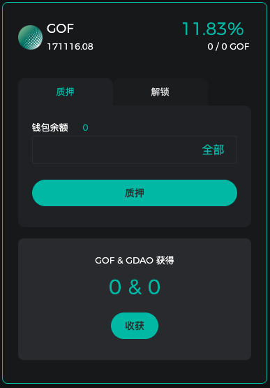
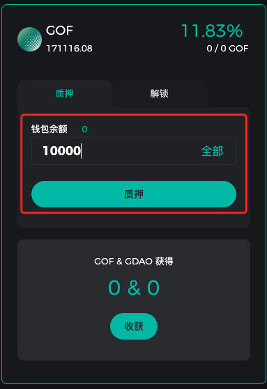
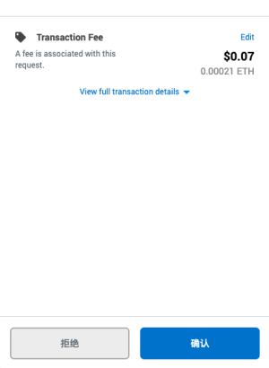

# Golff Farm 操作手册

## PC端操作教程

1. 准备钱包和充足的代币，需准备一些ETH作为合约手续费

[Metamask钱包下载链接](https://metamask.io/download.html)
[BitKeep钱包下载链接](https://www.bitkeep.com/)

2. 访问Farm产品页，[以太链](https://app.golff.finance/farm),[Heco版](https://heco.golff.finance/farm)。以以太链为例。

3. 链接钱包

PC使用MetaMask钱包进行链接，移动端使用BitKeep钱包扫码访问或使用MetaMask钱包输入地址访问

4. 钱包授权

链接完钱包后，选择一个池子进入，先进行钱包授权，需要支付一定ETH作为合约手续费

5. 存入挖矿

完成授权后点击“存入”按钮，选择/输入要质押的数量存入挖矿池（存入时需要支付一定ETH作为合约手续费）

## 手机端Farm操作教程

#### 视频教程

1. BitKeep版

[video](images/GOFFarm/video1.mp4 ':include')

2. imToken版

[video](images/GOFFarm/video2.mp4 ':include')

#### 图文教程

1. 下载手机钱包

- BitKeep下载地址：https://bitkeep.org/
- imToken下载地址：https://www.token.im/

2. 创建或导入ETH钱包地址

根据手机钱包流程创建或者导入ETH私钥，创建好对应的ETH账户。
在开始挖矿前请向该地址准备一定数量的ETH。

3. 访问Golff

通过钱包菜单找到Golff或者在地址栏输入Golff Farm地址进入Golff Farm界面

Golff Farm地址页面：https://app.golff.finance/farm

BitKeep可直接搜索Golff找到Golff Farm入口

?> 注意：进入页面前可能会提示第三方APP访问确认，点击确认即可

  

4. 链接钱包

点击钱包连接，并完成授权操作

 

5. 授权参与
选择需要参与的对应的矿池，并进入对应挖矿界面，点击钱包授权

（该环节会有少量ETH手续费支出）

6. 存入代币开启挖矿

选择/输入要质押的数量存入挖矿池，并点击存入，此时会需要进行手续费确认，确认后即完成存入动作，等待GOF挖矿收益发放即可。
（存入时需要支付一定ETH作为合约手续费）

 