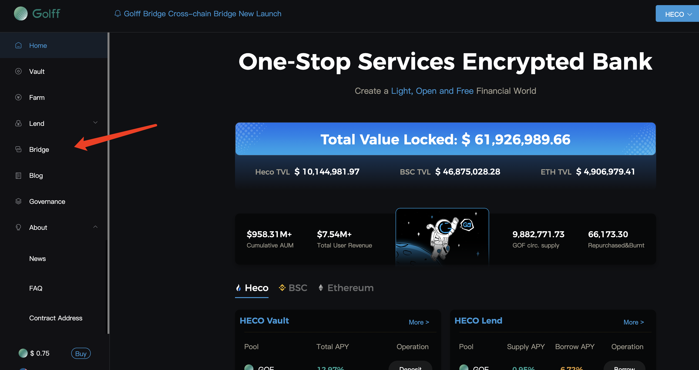
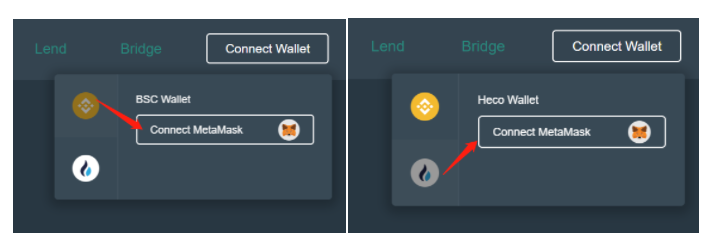
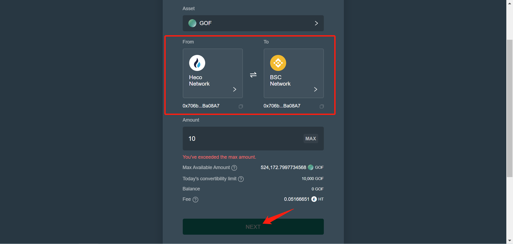
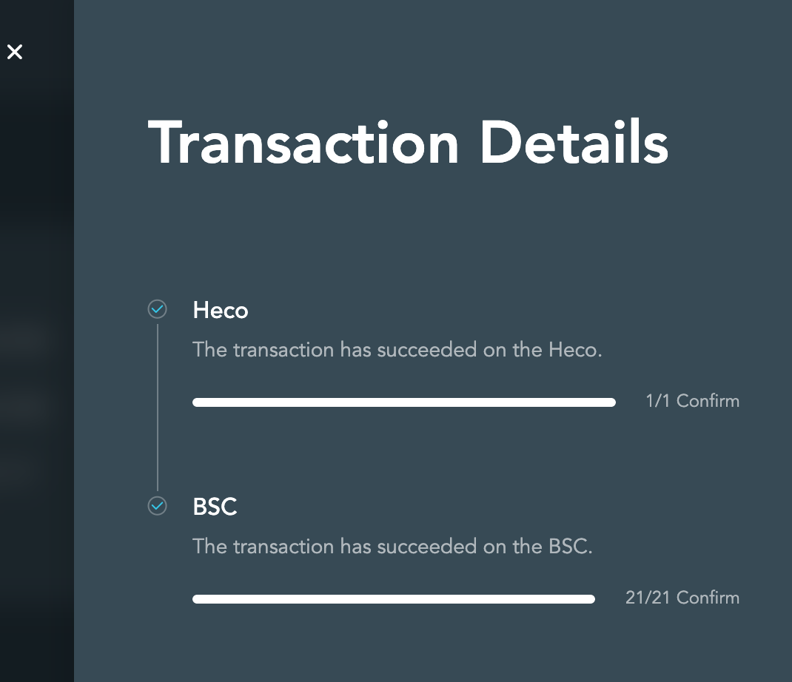

# Golff Bridge跨链桥操作手册

## 关于 Golff Bridge

Golff Bridge全新跨链桥已正式上线，为方便大家更好理解并使用，简单为大家介绍一下跨链桥的操作步骤。

目前Golff产品已在以太坊、Heco、BSC三条链上完成部署，使用跨链桥可以帮助用户实现资产跨链，即用户把一个链上的资产，以快速、低成本的转移到另一链上。当前Golff Bridge 跨链桥实现币安智能链 BSC 与火币生态链 HECO 资产跨链服务，并首先支持 GOF 跨链。

## 跨链桥操作手册Tutorial

举例说明：heco链上的GOF如何跨链到BSC链

1. 首先我们用PC端浏览器（手机端用heco链钱包）打开[Golff官网](https://golff.co/)，打开之后找到跨链桥按钮并点击（或直接访问跨链桥地址：https://bridge.golff.com）

2. 进入跨链桥页面后，首先连接钱包，点击右上角“Connect Wallet”按钮，分别需连接BSC链钱包和Heco钱包，两条链都完成连接即可，如下图

3. 正确连接钱包后，我们选择需要跨链过去的资产（目前只支持GOF），我们这里是从heco跨链到BSC，所以选择From Heco  to  BSC链，接着输入需要跨链过去的金额，点击下一步确认完成。

> ** 注：每日8:00（UTC+8）更新当天账户可兑换GOF额度

4. 等待链上数据完成同步并完成转账。

这样就能在对应地址的BSC链上查看到刚才跨链的过去的资产。

反之，GOF从BSC链跨到heco链也是同理操作。