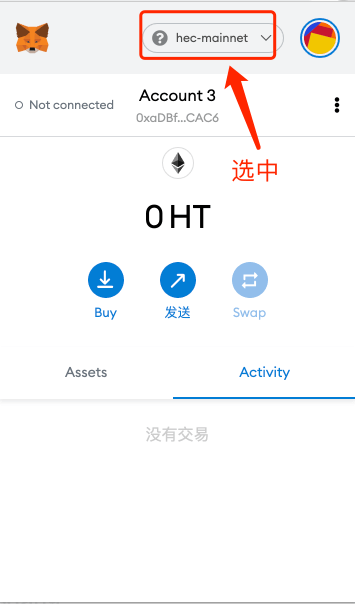
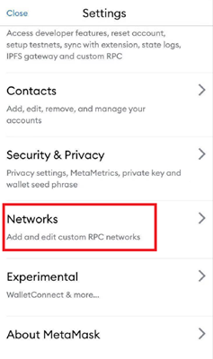
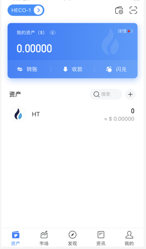
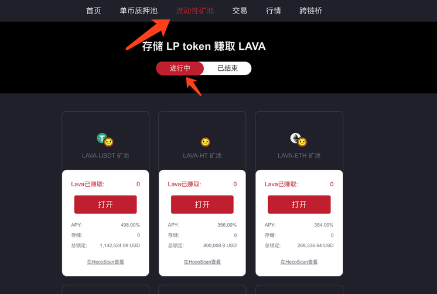
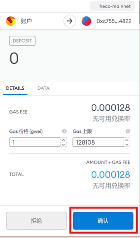

# Heco相关操作手册

## MetaMask钱包配置HECO教程

#### PC端

1. 点击⽹络选择


2. ⾃定义 RPC


3. 添加⽹络信息


 
**信息如下：**
```
- 新增RPC URL:
	中国大陆：https://http-mainnet-node.huobichain.com
	其他地区：https://http-mainnet.hecochain.com
- 链ID:128
- 符号：HT
- 屏蔽管理器URL：https://hecoinfo.com/
```
 
3. 选中⽣态链主⽹⽹络 



#### 手机端

MetaMask手机端更改网络连接的选项是在“Setting（设置）”标签下，选择“Networks(网络)”，再选择“Add Networks（添加网络）”，输入HECO主网信息（输入的信息与电脑端相同），即可添加网络。



**配置信息:**
```
- 网络名称：heco-mainnet
- 新增RPC URL:
	中国大陆：https://http-mainnet-node.huobichain.com
	其他地区：https://http-mainnet.hecochain.com
- 链ID:128
- 符号：HT
- 屏蔽管理器URL：https://hecoinfo.com/
```

## 手机钱包访问Golff Heco版教程

#### Bitkeep钱包
1. 下载Bitkeep：[下载地址](https://bitkeep.org/)

2. 打开Bitkeep APP，点击底部菜单的“DApp”，选择顶部的Heco，或者搜索框输入“golff”，进入Golff（HECO版）

?> 注：第一次使用Bitkeep时，需先在首页-钱包里面添加HT才能正常接入heco链。

 

#### 火币钱包
1. 下载火币钱包：[下载地址](https://www.huobiwallet.com/)
2. 打开火币钱包APP，创建HECO钱包。
3. 进入首页，搜索框输入地址：heco.golff.finance，点击进入

 

4. 选择HECO钱包，点击地址进入Golff（HECO版）


#### TokenPocket钱包
1. 下载TokenPocket ：[下载地址](https://www.tokenpocket.pro/)
2. 进入 TokenPocket App，选择Heco链。



3. 点击底部菜单的“发现”，在搜索框输入heco.golff.finance，点击进入


4. 开启Golff（HECO版）

## LavaSwap GOF流动性挖矿教程

开始挖矿挖矿前请确认您的钱包在Heco环境下，并确保地址中存有足额的HT作为手续费
[《MetaMask钱包配置HECO教程》](Heco)

#### 添加流动性获取LP凭证
1. 登录LAVAswap交易界面：[LavaSwap](https://exchange.lavaswap.com)

2. 在“Liquidity”页面，点击“Add Liquidity（增加流动性）”

 

3. 选择需要增加流动的代币GOF和USDT，输入其中一个代币的数量，系统将对您输入的代币数量自动计算出所需的另外一个代币的数量，点击“Supply（提供）”。无法搜索到代币可通过一下合约地址直接找到对应代币。

Heco GOF 合约地址：
```
0x2aafe3c9118db36a20dd4a942b6ff3e78981dce1
```

Heco USDT 合约地址：
```
0xa71edc38d189767582c38a3145b5873052c3e47a
```


4. 提交后会跳出确认授权的弹窗，点击“确认“并耐心等待链上打包即可。


?> 注意：添加流动性会因币价波动存在一定无常损失，请自行把控风险。

#### 质押LP进行挖矿

在上述添加流动性成功后将会获得对应的LP凭证，将对应LP质押到矿池中即可开始挖矿。

1. 进入LavaSwap流动性矿池页面，并找到对应GOF-USDT 矿池



2. 进入LP池子之后，可以看的您当前相应的LP Token余额，点击“抵押代币”


3. 输入您想抵押的金额，即可进行抵押。点击“抵押”（首次参与需点击Approve进行一次确认）


4. 提交后会跳出确认授权的弹窗，点击“确认“并耐心等待链上打包即可。



质押成功后，可刷新页面，即可看到LP Token已经被成功抵押。您可以随时取消抵押、提取奖励。
