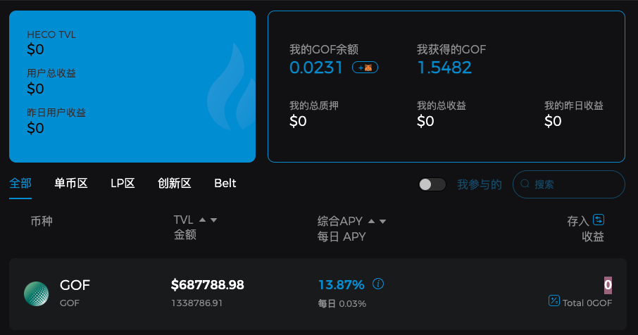
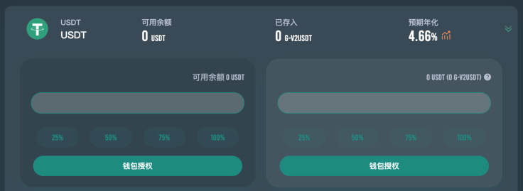
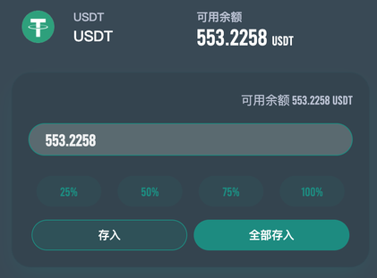
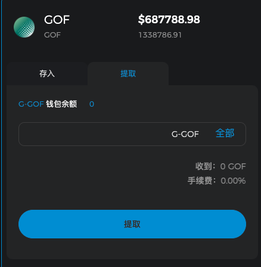
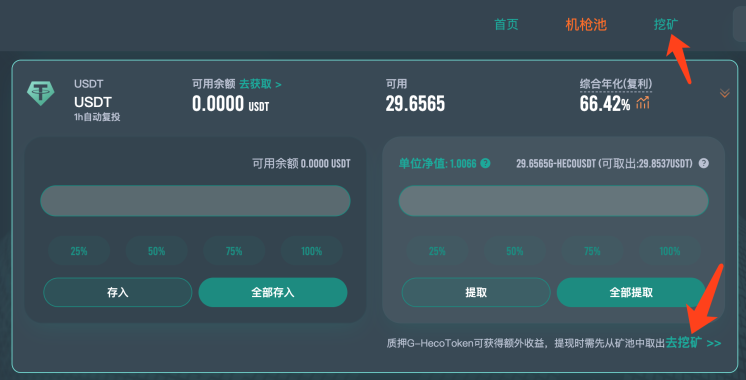
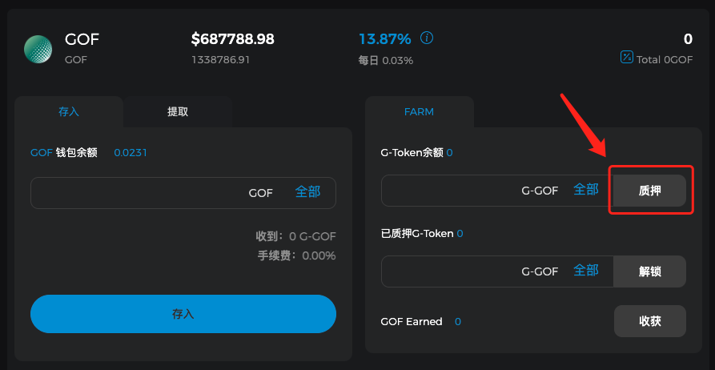
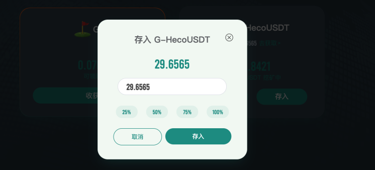

# Heco Golff Vault机枪池产品操作手册

## 什么是Heco Golff Vault

Heco Golff Vault是一个基于火币生态链的智能化收益聚合器(Earn Collection), 是基于自动实现最佳收益策略配置的DeFi协议。它能为投资人一键获取Heco链上最优收益，从而在大大降低普通投资者进入门槛的同时，能减少因信息不对称而导致的收益损失。

## Heco Golff Vault有哪些优点

1. 免去流动性挖矿复杂的合约操作环节，Heco版本的Golff Vault可以帮助用户节省更多合约操作手续费，用户只需充值资产给Golff Vault Heco版智能合约作为代理，一键充值/提现，就能获得市场上最佳收益；
2. 前期由核心团队的10多位全职合约工程师进行开发，并且每个合约都经过全球知名安全公司进行代码审计，最大程度上保证合约的安全。同时，Golff的社区工程师团队也在逐步组建，我们欢迎所有的优秀开发者加入Golff的合约开发和审计中来。未来，Golff的保险产品也会支持对与Heco Golff Vault中的策略进行承包，进一步减少可能的风险损失；
3. 由社区内20多位策略分析师进行市场信息收集，第一时间发现高收益策略，并提交合约组进行开发，相比原先的Golff Vault V2，Heco版的Vault切换策略会更加的频繁，最快地将机枪池中的资金投入到收益更高的策略中；
4. Heco Golff Vault是由 Golff DAO 治理的智能合约，资金由合约去中心化托管，无需信任第三方；
5. 收益策略自动再平衡：根据当前市场情况，Heco Golff Vault机枪池会自动切换策略。对于某个币种来说，用户无需提币再充值到新池子，即可获得当前市场最高收益。每个币种的唯一池子就是当前市面上最高收益的Vault
6. 最新版本的Heco Golff Vault将增加自动复投功能，在用户无需额外操作的情况下，帮助用户的资金达到利益最大化

## Golff Vault机枪池使用流程

1. 打开官网，准备钱包和充足的代币，需准备一些HT作为合约手续费。（需要将Metamask/移动端钱包切换至Heco网络，切换教程）

Heco Golff Vault参与地址：https://heco.golff.finance/vault

2. 选择要参与质押的币种，目前已支持：USDT、SKM、LAVA、HT、HUSD、HBTC、ETH、HDOT、HFIL、HLTC、HPT、MDX、BCH、UNI（后续将陆续支持更多币种）

3. 存入前先对币种进行钱包授权

4. 然后输入数量，点击“存入”（也可以一键点击“全部存入”），即可开启Golff Vault挖矿，获得当前市场上的最佳收益

5. 存入成功后，链上钱包中会收到对应数量的G-HecoToken，可以在Heco浏览器上查看G-HecoToken余额，或者在钱包中添加对应币种合约地址查看，每一个G-HecoToken代表了您在该Vault池中可领取的资金份额

6. 输入数量点击右侧“提取”或点击“全部提取”，即可领取对应G-HecoToken在该Vault池中可兑换的Token数量

## 使用G-HecoToken参与挖矿

1. 打开Farm界面，可直接通过地址：https://heco.golff.finance/farm 进入，或在机枪池参与页进入

2. 选择对应的矿池并点击进入，将参与机枪池所获得的G-HecoToken存入

3. 输入存入的G-HecoToken数量，并点击存入即可

?> 注意：G-HecoToken存入Farm池后，此时在机枪池页面的可用余额会显示为0，若需取回本金，需先将Farm池中的G-HecoToken取回方可看到对应的本金及收益。

## 收益分配

Heco Golff Vault池子中产生的各种加密货币的收益会自动放入Vault资金池，其中91%收益分配给资金投入者，剩余9%用于在二级市场回购GOF，其中4%为社区开发者基金，4%销毁，1%为风险储备金，harvest合约调用手续费由开发者基金承担。风险储备金用于弥补因不可预见的风险而给Vault投资人带来的亏损。二级市场的回购会在DEX中进行，在回购前会公布主要进行回购操作的DEX。

收益的产生和分配全过程通过智能合约在链上实现，完全公开透明，接受全社区的监督。未来可以通过社区的投票治理去更改收益分配中的主要参数。