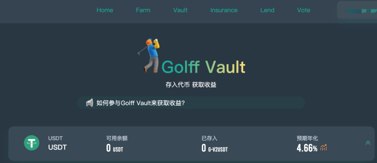
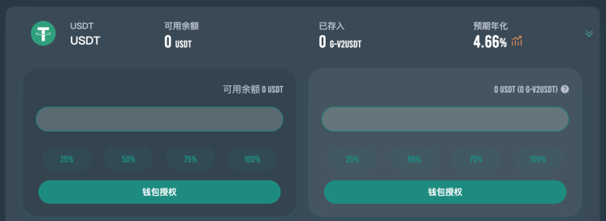
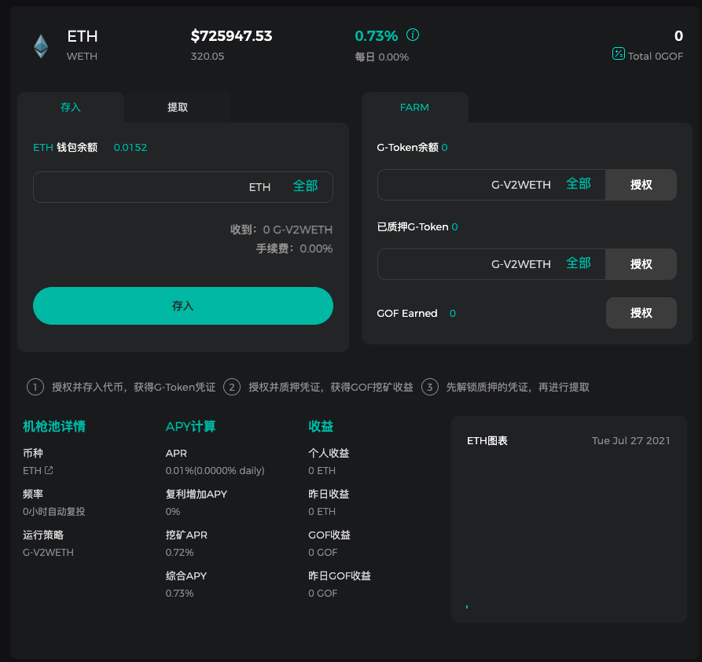
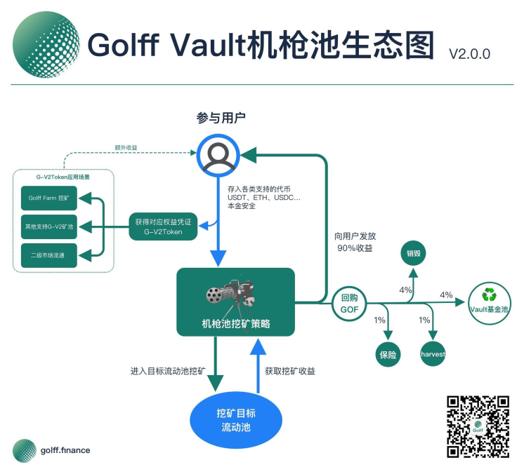

# Vault V2机枪池产品操作手册

## 什么是Golff Vault

Golff Vault就是一个智能化的收益聚合器(Earn Collection), 基于自动实现最佳收益策略配置的DeFi协议。它能够帮助投资人一键获取市场最优收益，从而在大大降低普通投资者进入门槛的同时，能减少因信息不对称而导致的收益损失。

## Golff Vault V2有哪些优点

1. 免去流动性挖矿复杂的合约操作环节，节省用户高昂Gas费用，只需充值资产给Gollf Vault V2智能合约作为代理，一键充值/提现，就能获得市场上最佳收益
2. 前期由核心团队的10多位全职合约工程师进行开发，并且每个合约都经过两家以上的全球知名安全公司进行代码审计，最大程度上保证合约的安全。同时，Golff的社区工程师团队也在逐步组建，我们欢迎所有的优秀开发者加入Golff的合约开发和审计中来。未来，Golff的保险产品也会支持对与Golff Vault V2中的策略进行承包，进一步减少可能的风险损失。
3. 由社区内20多位策略分析师进行市场信息收集，第一时间发现高收益策略，并提交合约组进行开发
4. Golff Vault V2是由 Golff DAO 治理的智能合约，资金由合约去中心化托管，无需信任第三方
5. 收益策略自动再平衡：根据当前市场情况，Golff Vault V2机枪池会自动切换策略。对于某个币种来说，用户无需提币再充值到新池子，即可获得当前市场最高收益。每个币种的唯一池子就是当前市面上最高收益的Vault。

## Golff Vault机枪池使用流程
1. 打开官网 https://app.golff.finance/vault ，准备钱包和充足的代币，需准备一些ETH作为合约手续费
2. 选择要参与质押的币种

3. 存入前先对币种进行钱包授权

4. 然后输入数量，点击“存入”（也可以一键点击“全部存入”），即可开启Gollf Vault挖矿，获得当前市场上的最佳收益

存入成功后，链上钱包中会收到对应数量的G-V2Token，可以在以太坊区块浏览器上查看G-V2Token余额，或者在钱包中添加对应币种合约地址查看，每一个G-V2Token代表了您在该Vault池中可领取的资金份额

5. 输入数量点击右侧“提取”或点击“全部提取”，即可领取对应G-V2Token在该Vault池中可兑换的Token数量

## 收益分配

Golff Vault池子中产生的各种加密货币的收益会自动放入Vault资金池，其中90%收益分配给资金投入者，剩余10%用于在二级市场回购GOF，其中4%为社区开发者基金，4%销毁，1%为风险储备金，1%harvest合约调用。风险储备金用于弥补因不可预见的风险而给Vault投资人带来的亏损。二级市场的回购会在DEX中进行，在回购前会公布主要进行回购操作的DEX。
收益的产生和分配全过程通过智能合约在链上实现，完全公开透明，接受全社区的监督。未来可以通过社区的投票治理去更改收益分配中的主要参数。

## 关于G-V2Token

#### 1.什么是G-V2Token？

G-V2Token是Golff核心产品业务Vault V2（机枪池）的权益Token，为原GToken的升级版本。G-V2Token承载了Golff的核心业务价值，将投资者存入Golff Vault的普通Token转化为生息G-V2Token，并通过机枪池的自动优化收益策略，持续提升G-V2Token的价值。同时G-V2Token符合ERC20标准，可用于与其他DeFi产品进行乐高式组合，生成更为复杂的DeFi衍生品。

#### 2.为什么要开发G-V2Token？对Golff有哪些好处？

Golff Vault机枪池在实际应用时不可避免的需要用户锁定相应Token在资金池中用于策略的执行，用户会因各种需求提取资金，造成Golff Vault资金外流。G-V2Token则可有效解决资金外流的问题，因G-V2Token机制会保证其价值永久高于Token，且会不断增长，当用户需要资金时，无需从机枪池提取本金，只需用G-V2Token在Uniswap等平台直接交易成Token即可。同时Golff Vault在功能上进行了优化，对闪电贷以及巨鲸稀释池内权益等方面做了防范，让投资者的利益得到充分保障。

#### 3.G-V2Token的机制是怎样的，与GToken有何差异？

Golff Vault 2.0（机枪池）内每个币种均对应于一个专属G-V2Token，如ETH机枪池产生的权益G-V2Token为G-V2ETH，代表了用户对机枪池内ETH资产的权益份额。由于Golff机枪池采用的是本金无损策略，目标矿池的收益会由合约自动兑换成本币Token，因持续的收益放入池内，而G-V2Token的数量不变，用户可凭借G-V2Token可兑换的Token数量越多，G-V2ETH价格相对于ETH的汇率也会持续提升。但随着池内资金的增加，价格增长速度会伴随减慢，而旧版Golff Vault 1.0采用的是GToken与Token恒定1:1锚定关系，未能绑定收益，将限制GToken的流通价值。G-V2Token的全新特性将可促进G-V2Token在二级市场替代原Token的流通。

#### 4.Golff Vault V2 收益如何分配？

用户资金进入机枪池后，会自动配置该币种下最优挖矿策略，在保证本金安全前提下进行最高收益挖矿。其利润的90%将通过DEX将收益兑换成本币进入资金池，其余10%将用于二级市场回购GOF，具体分配如下：
- Harvest收割奖励 1%，用于补贴收割gas费用。频繁调用 Harvest 有助于减少收割时产生的滑点，增加机枪池用户整体收益。
- 风险储备金为1%，风险储备金用于弥补因不可预见的风险而给Vault投资人带来的亏损。
- 4%用于在二级市场回购GOF进入Vault基金池，用途后续由社区决定。
- 4%回购的GOF将进行直接销毁。